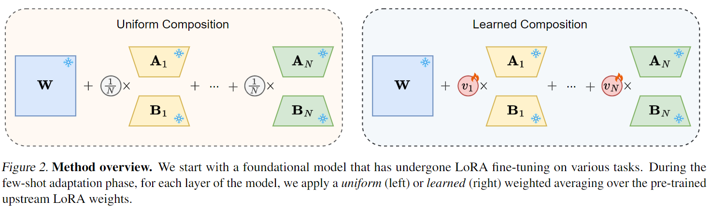

> Note: This is an unofficial implementation of WLoRA. This method will be merged into the HuggingFace PEFT package. 

# WLoRA: Does Combining Parameter-efficient Modules Improve Few-shot Transfer Accuracy?


**Paper:** [arxiv.org/abs/2402.15414](https://arxiv.org/abs/2402.15414)



**Authors:** Nader Asadi\*, Mahdi Beitollahi\*, Yasser Khalil, Yinchuan Li, Guojun Zhang, Xi Chen.

**Abstract:** Parameter-efficient fine-tuning stands as the standard for efficiently fine-tuning large language and vision models on downstream tasks. Specifically, the efficiency of low-rank adaptation has facilitated the creation and sharing of hundreds of custom LoRA modules, each trained on distinct data from various downstream tasks. In this paper, we explore the composability of LoRA modules, examining if combining these pre-trained modules enhances generalization to unseen downstream tasks. Our investigation involves evaluating two approaches: (a) uniform composition, involving averaging upstream LoRA modules with equal weights, and (b) learned composition, where we learn the weights for each upstream module and perform weighted averaging. Our experimental results on both vision and language models reveal that in few-shot settings, where only a limited number of samples are available for the downstream task, both uniform and learned composition methods result in better transfer accuracy; outperforming full fine-tuning and training a LoRA from scratch. Moreover, in full-shot settings, learned composition performs comparably to regular LoRA training with significantly fewer number of trainable parameters. Our research unveils the potential of uniform composition for enhancing transferability in low-shot settings, without introducing additional learnable parameters.

**Contributors:** Mahdi Beitollahi

## Features
- :fire: Combines multiple pre-trained LoRA modules to improve downstream task performance.
- :key: Learns the best combination weights of LoRAs during training.
- :star: Built on top of PEFT, supporting Accelerate, 4-bit training, HuggingFace models, etc.
- :checkered_flag: Supports linear layers (e.g. attentions, fc, etc).

## About this method

**What’s implemented:** The code implements the learned composition in  *Does Combining Parameter-efficient Modules Improve Few-shot Transfer Accuracy?* (Asadi et al., 2024). More specifically, it learns the $v$ for the weighted sum of LoRA modules as follows.

```math
\hat{\mathbf{W}} = \mathbf{W}_{base} + \sum_{n=1}^{N} \hat{v}_n \left( \frac{\alpha_n}{r_n} \mathbf{A}_n \mathbf{B}_n\right), 
```
```math
\sum_{n=1}^{N}\hat{v}_n=1,
```
where $\hat{v}$ is the softmax operation applied on the weighting vector $v$, i.e.,
```math
\hat{v}_n=e^{v_n}/\left(\sum_{j=1}^{N}e^{v_j}\right)
```
We named the parameter $v$ as `wlora_weights` in the model parameters. 


## Install
```bash
# Cd into the peft directory
cd /peft

# Install Peft. 
pip install .
```

## Usage example
The following script is an example of how to load two pre-trained LoRA modules and learn the combination weights for LLMs. This script is available in the `docs/example.ipynb` notebook.

First, we load the base model
```python
from transformers import AutoModelForCausalLM, AutoTokenizer
from peft import PeftConfig

# Load base model
base_model = "facebook/opt-350m"
tokenizer = AutoTokenizer.from_pretrained(base_model)
model = AutoModelForCausalLM.from_pretrained(base_model)
```

Then, we add the two LoRAs and make their weight trainable.
```python
# Add the first LoRA with learnable weight to the base model
lora_1 = "varun-v-rao/opt-350m-lora-1.57M-squad-model3"
lora_1_config = PeftConfig.from_pretrained(lora_1)
lora_1_config.use_wlora =True
model.add_adapter(adapter_config=lora_1_config, adapter_name='lora_1')

# Add the second LoRA
lora_2 = "renyulin/finetune_fp4_opt_bnb_peft_opt-350m-lora"
lora_2_config = PeftConfig.from_pretrained(lora_2)
lora_2_config.use_wlora =True
model.add_adapter(adapter_config=lora_2_config, adapter_name='lora_2')

# Activate LoRA modules as trainable
model.set_adapter(['lora_1', 'lora_2'])
```

Modules are successfully loaded and you can treat the model as any HuggingFace or `torch.nn.Module` and use any training method. Following is an example of using the HuggingFace Trainer.
```python
# Train the wights of LoRA modules
from transformers import TrainingArguments, Trainer

training_args = TrainingArguments(
    output_dir="wlora-model",
    evaluation_strategy="epoch",
    learning_rate=1e-4,
    weight_decay=0.01,
    push_to_hub=False,
)

trainer = Trainer(
    model=model,
    args=training_args,
    train_dataset=lm_dataset["train"],
    eval_dataset=lm_dataset["test"],
    data_collator=data_collator,
)

trainer.train()
```


**Contributions and suggestions:** If you have any suggestions, please feel free to let us know. We would love to hear your feedback.
